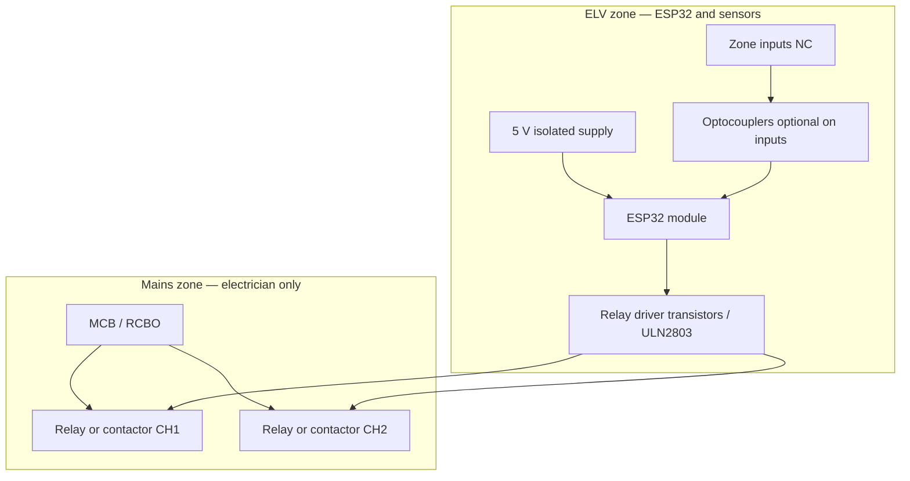

# Home automation controller — circuit concept (ELV)

This is a **reference block diagram** for a **low‑voltage** controller that matches the ESP32 firmware in `firmware/esp32/`. It is **not** a certified schematic — use it as a starting point for your own KiCad/EasyEDA project and **peer review**.

## Block diagram

## Power tree (typical)

| Rail | Source | Notes |
|------|--------|------|
| 5 V | USB adapter or DIN SELV module | Powers relay coils **only if** coil rating matches; prefer **relay modules with separate VCC** and **logic inputs**. |
| 3.3 V | ESP32 on‑module regulator | Do not overload; sensors should be **low current**. |

## Relay outputs (logic → load)

- **Do not** switch mains on the ESP32 devkit’s tiny relay if current / category is unknown.
- Prefer **DIN contactors** or **certified relay modules** with **screw terminals** for the **load**; drive them with **open‑collector** or **low‑side** switching that matches the module’s input spec (often 5 V, **active‑high** with common GND).

## GPIO protection

- Add **series resistor** (e.g. 100 Ω–1 kΩ) on inputs from long cable runs.
- Add **TVS** or **ESD** protection at the connector if cables leave the enclosure.
- For **burglar zones**, see [burglar-alarm-zones.md](burglar-alarm-zones.md).

## MQTT topics (this repo)

Aligned with `firmware/esp32/src/main.c`:

- `home/{HA_HOME_ID}/device/{MAC}/command` — subscribe
- `home/{HA_HOME_ID}/device/{MAC}/state` — publish retained online
- `home/{HA_HOME_ID}/device/{MAC}/telemetry` — periodic + optional zone JSON

## PCB layout notes (when you draw the board)

- **Keep** relay drivers and any **inductive** kickback **away** from the ESP32 crystal / antenna area.
- **Ground pour** on ELV side; **star ground** at supply entry.
- **Fuse** the 5 V input to the PCB at a sensible current (e.g. 1–2 A polyfuse) for fault containment.
